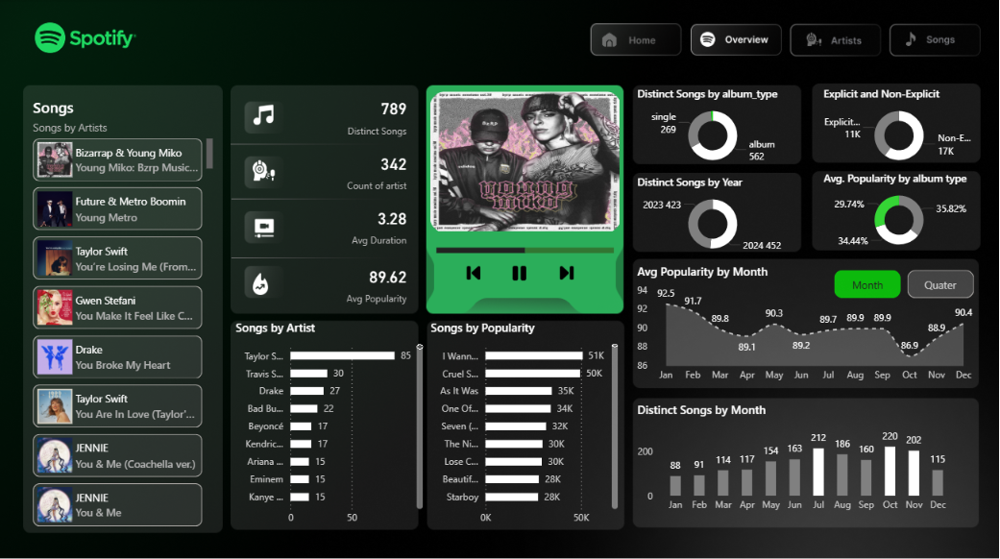
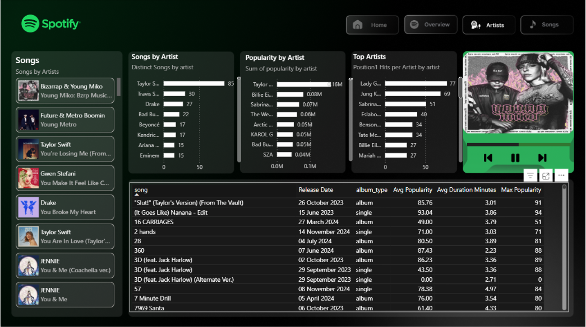
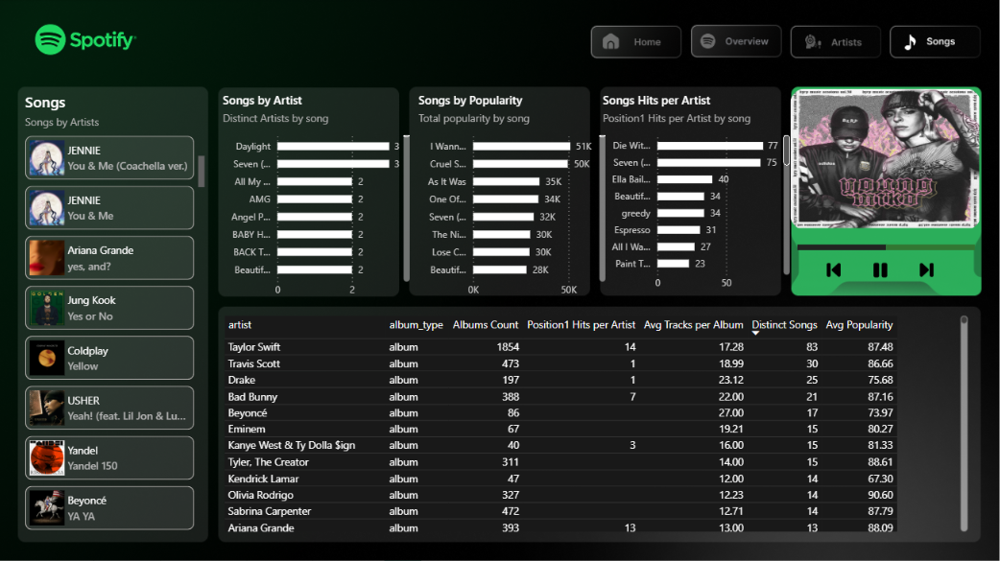

# 🎵 Spotify Global Top 50 — Power BI Dashboard

> **Course Project | INT374 – Data Analytics with Power BI**  
> Lovely Professional University · B.Tech CSE · Dec 2025

---

## 🔗 Live Dashboard

👉 **[Click here to view the Live Dashboard](https://app.powerbi.com/view?r=eyJrIjoiYTNhNGZmOTgtMDFlMS00OTM2LWE0NTgtMjI1Yjk0ZjNkNzUxIiwidCI6ImUxNGU3M2ViLTUyNTEtNDM4OC04ZDY3LThmOWYyZTJkNWE0NiIsImMiOjEwfQ%3D%3D)**

---

## 📌 Overview

An end-to-end **Business Intelligence dashboard** built in Microsoft Power BI, analyzing the **Spotify Global Top 50** charts from mid-2023 through 2024. The dashboard decodes music streaming trends — from artist dominance to song duration shifts — using a real-world dataset and advanced DAX measures.

---

## 🖼️ Dashboard Preview

**Home Page**


**Overview Page**


**Artists Page**


**Songs Page**


---

## 📁 Project Structure

```
Spotify-PowerBI-Dashboard/
│
├── Spotify_dashboard1.pbix                          # Main Power BI file
├── spotify-top-50-world.csv                         # Source dataset
├── Power BI Spotify Dashboard Project - Google Docs.pdf   # Project report
├── Images/                                          # Dashboard screenshots
│   ├── Index.png
│   ├── OverView.png
│   ├── Artists.png
│   └── Songs.png
├── Icons Imgaes/                                    # Icons used in dashboard
└── README.md
```

---

## 📊 Dataset

| Attribute | Details |
|---|---|
| **Source** | Spotify Global Top 50 (via Kaggle) |
| **File** | `spotify-top-50-world.csv` |
| **Period** | Mid-2023 to 2024 |
| **Granularity** | Daily chart snapshots (positions 1–50) |

**Key Columns:** `date`, `position`, `song`, `artist`, `popularity`, `duration_ms`, `album_type`, `release_date`, `is_explicit`, `album_cover_url`

---

## ⚙️ ETL & Data Preprocessing (Power Query)

- **Date Standardization** — Fixed type mismatches; normalized mixed-format `release_date` entries
- **Duration Conversion** — Created `Duration_Mins` column (`duration_ms / 60000`)
- **Explicit Flag Normalization** — Converted `TRUE/FALSE` text to logical type for DAX compatibility
- **Text Cleaning** — Trimmed whitespace from artist names; capitalized `album_type` values

---

## 🧮 DAX Measures Implemented

```dax
-- Distinct Songs
Distinct Songs = DISTINCTCOUNT('Top-50-world'[song])

-- Average Popularity
Avg Popularity = AVERAGE('Top-50-world'[popularity])

-- Position #1 Hits per Artist
Position1 Hits = CALCULATE(COUNTROWS('Top-50-world'), 'Top-50-world'[position] = 1)

-- % Explicit Songs
Pct Explicit = DIVIDE([Explicit Songs Count], [Total Songs], 0)

-- Average Duration in Minutes
Avg Duration (Mins) = AVERAGE('Top-50-world'[duration_ms]) / 60000
```

---

## 📈 Dashboard Pages

| Page | Description |
|---|---|
| **Home** | Landing page with navigation |
| **Overview** | Executive KPIs — 789 Distinct Songs, 342 Artists, Avg Popularity 89.62 |
| **Artists** | Taylor Swift leads with 85 distinct charting songs |
| **Songs** | Track-level analysis — popularity, duration, explicit status |

---

## 🔍 Key Insights

1. **Superstar Consolidation** — Taylor Swift & Bad Bunny dominate through "Album Bombs," occupying 20–30% of the Top 50 simultaneously on release
2. **Singles Win for Everyone Else** — For non-superstars, singles released every 4–6 weeks keep algorithmic momentum high
3. **Songs Are Getting Shorter** — Avg duration ≈ 3 min 28 sec; streaming economics reward replay over length
4. **Explicit Content Is Mainstream** — ~35–40% of Top 50 tracks are explicit; no longer a barrier to success
5. **Global Diversification** — Bad Bunny, Peso Pluma, Jung Kook confirm Latin and K-Pop as global forces

---

## 🛠️ Tech Stack

| Tool | Usage |
|---|---|
| **Microsoft Power BI Desktop** | Dashboard development |
| **Power Query (M Language)** | ETL & data transformation |
| **DAX** | Custom measures & KPIs |
| **CSV / Kaggle Dataset** | Source data |

---

## 🎓 Academic Details

| Field | Info |
|---|---|
| **Student** | Yogesh Yadav |
| **Reg. No.** | 12312204 |
| **Course** | INT374 – Data Analytics with Power BI |
| **University** | Lovely Professional University |
| **Faculty Mentor** | Ms. Savleen Kaur |
| **Submitted** | December 24, 2025 |

---

## 🚀 How to Open Locally

1. Clone this repository
2. Open `Spotify_dashboard1.pbix` in **Microsoft Power BI Desktop**
3. If prompted for data source, point it to `spotify-top-50-world.csv` in the same folder
4. Explore all 4 dashboard pages using the navigation buttons

---

## 📄 License

This project is for academic purposes. Dataset sourced from [Kaggle](https://www.kaggle.com/datasets/prathamsaraf1389/spotify-global-top-50-dailyupdate).
